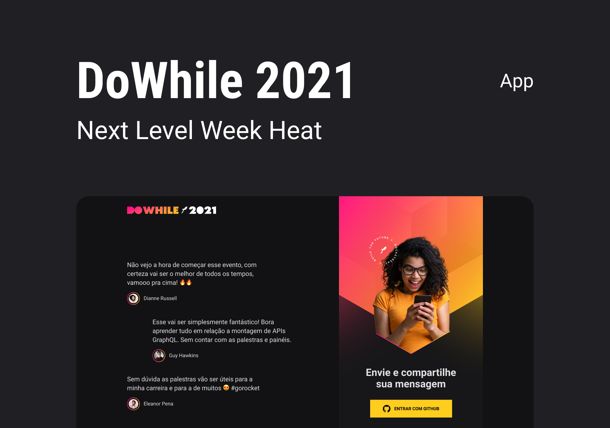

<h1 align="center">NWL Heat</h1>

  

## Project

In this project was developed a web application and a mobile application where users can comment about your expectations to event Do While 2021. The user needs to sign in with GitHub to can send messages. The user can accompany in real time the messages send by another users. Every day it is execute a Elixir routine to generate a words cloud from words message sent.

## Features

- Sign in with GitHub;
- Update messages list in real time with Web Socket;
- Scheduled Elixir routine;

## Technologies and Libraries

General:

- [Node.JS v16.13.0](https://nodejs.org/en/)
- [NPM 8.1.0](https://www.npmjs.com/)
- [Visual Studio Code 1.62.0](https://code.visualstudio.com/)

Back-end with Node.JS and TypeScript:

- Express
- Cors
- [axios](https://www.npmjs.com/package/axios)
- Prisma
- [Json Web Token](https://www.npmjs.com/package/jsonwebtoken)
- Socket IO

Web application with React JS and TypeScript:

- [Vite](https://vitejs.dev/#overview)
- [axios](https://www.npmjs.com/package/axios)
- Socket IO Client

Mobile application with Expo and TypeScript:

- Expo 5.0.3
- Socket IO Client
- [axios](https://www.npmjs.com/package/axios)
- Expo Auth Session
- React Native Iphone X Helper

## Mobile devices used in mobile application development

- Android (Physical): API 27
- Android (Emulator): API 30

## Layout

You can view the project layout through this [link](https://www.figma.com/file/KiXMhQjOcCXaB2gkd5Ukc1/%5BNLW-Heat---Mission%3A-Impulse%5D-DoWhile2021-(Community)?node-id=2%3A3). Figma account is required to access it.

## Database

  

## How to run

## License

This project is under the MIT license. See the [LICENSE](LICENSE.md) file for more details.